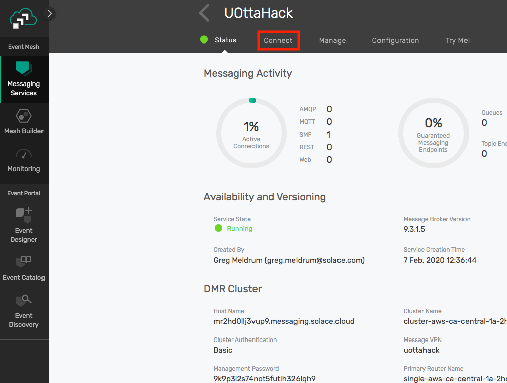
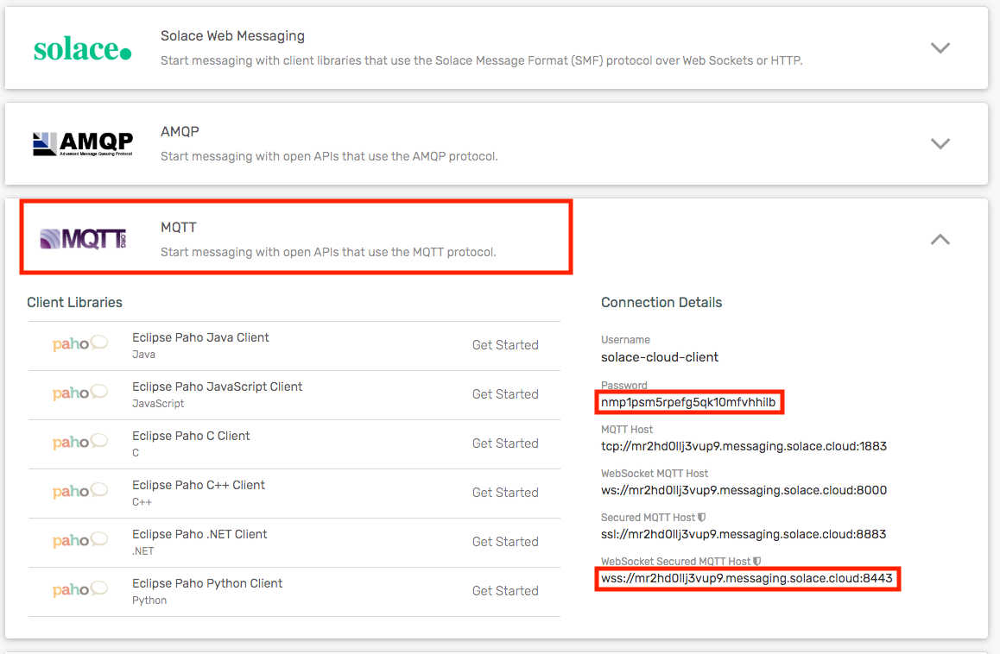
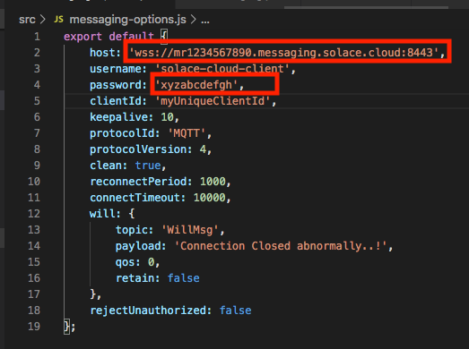

# solace-express-mqtt-example

A sample node express application which uses mqtt to exchange messages with a Solace PubSub+ broker.

- The express logic is in src/index.js
- The application logic is in src/App.js
- The messaging API is in src/Messaging.js
- The connection parameters are in src/messaging-options.js

## How to connect to Solace Broker

1) Head over to your service dashboard and select the Connect tab.

2) Open the MQTT tab and copy the contents of `Password` and `WebSocket Secured MQTT Host`

3) Paste the contents into the respective labels in the `/src/messaging-options.js` source file



## How to run the example code
1) npm install
2) npm run dev

If the Solace broker configuration is correct, you should see the following log:

`Succesfully connected to Solace Cloud. Connected!`

If you don't see this log, see the section "How to connect to Solace Broker"

## Interacting with the example code
By default, the application will connect to the Solace broker configured using the steps above.

The express server is setup with two endpoints which allow you to subscribe and publish.

### Subscribe

First you will need to subscribe to a Topic. To do that, initiate a POST operation to http://localhost:9001/subscribe

```
curl -X POST localhost:9001/subscribe
```

Now your app is subscribed to the `SomeTopic` topic.


### Publish
Next, puslish a message to this topic using the publish endpoint

`curl -X POST localhost:9001/publish`

At this point you should see a log

```
New message on topic: SomeTopic :: {"text":"Hello"}
Message as object { text: 'Hello' }
```

If you don't see this log, see the section "How to connect to Solace Broker"
